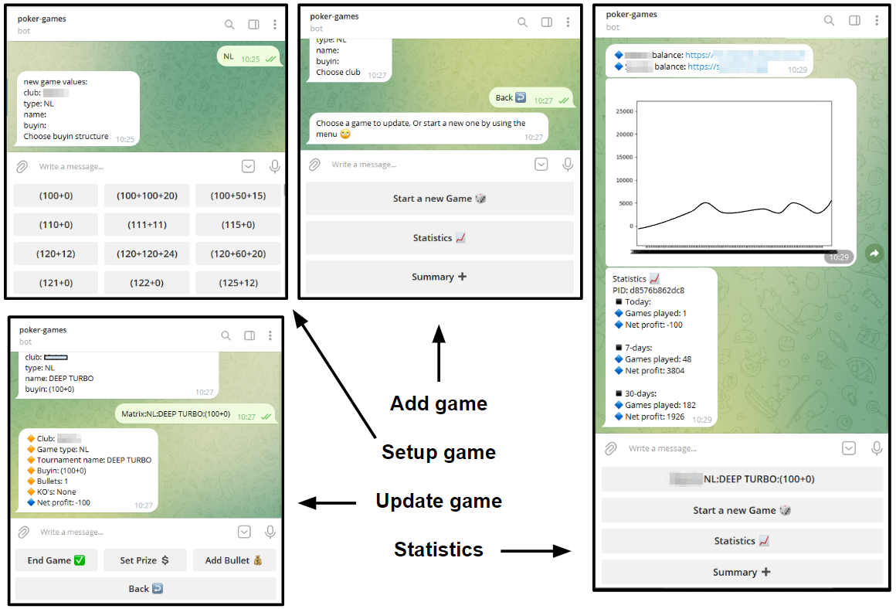

# GamesBot

----

This is a Telegram bot for tracking a poker player income. it provides an easy 
interface for a player to insert his data, which stored in a mysql database.



----

### Initial Configuration (Linux/Windows/MacOS)
1. Edit config.py with your db access credentials.
2. Contact @botfather on telegram to create a new bot. you will get username and a token.
3. Create 'credentials.py' containing your bot credentials. ie :


## Running on Linux/Max
### Create the credentials.py file

```bash
echo "bot_username = 'my_bot_username'" >> ./credentials.py
echo "token = 'my_bot_token'"           >> ./credentials.py
```

### Build the docker image
The bot is running inside a docker container which provides an 
isolated environment with all necessary libs. To build the image :
```bash
$ ./build-local-image.sh
```

### Running the bot
1. Start mysql if necessary (This will start a local dockem with mysql)
```bash
$ cd mysql && ./start-mysql.sh
```
2. start the container:
```bash
$ # start like this:
$ ./start-gamesbot.sh
$ # or restart like this:
$ ./stop-gamesbot.sh && ./start-gamesbot.sh
```

### Running on Windows
1. Install Chocolatey (windows package manager* NOTE: you can skip this and install MySQL directly)  
first, open a PowerShell window by right-click and choose 'Run as administrator'. 
A PowerShell blue window will open, follow this:

    ```powershell
    # check execution policy
    PS > Get-ExecutionPolicy
    
    # If the above returns Restricted, then run Set-ExecutionPolicy AllSigned:
    PS > Set-ExecutionPolicy AllSigned
    
    # Then install Chocolatey
    PS > Set-ExecutionPolicy Bypass -Scope Process -Force; [System.Net.ServicePointManager]::SecurityProtocol = [System.Net.ServicePointManager]::SecurityProtocol -bor 3072; iex ((New-Object System.Net.WebClient).DownloadString('https://community.chocolatey.org/install.ps1'))
    ```
2. Install MySQL database 
Open a new PowerShell window as described before (must be a NEW PowerShell window) and install MySQL:
    ```powershell
    PS > choco install mysql
    ```
3. Create the database and users
    ```commandline
    TODO: describe the procedure, tables will be created by the bot.
    currently need to create a db named db_gamesbot with user and password
    that has permissions over the database. the actions can be retrieved from looking at docker
    and docker-compose files
    ```
4. Install python3 and dependencies
    ```commandline
    TODO: describe procedure. basically creating a python3 venv and installing the
    libs from requirements.txt
    ```

5. Create config.py file with DB credentials
    ```bash
    # Main configuration
    db_host = 'localhost'
    db_name = 'db_gamesbot'
    db_user = 'user'
    db_password = 'password'
    ```

6. Starting the bot ( untested )
    ```powershell
    PS > python3.exe games-boy.py
    ```

## DB initial setup
The database is hosted on the same host (in my case) and running with docker-compose, all details in mysql/ folder
```bash
$ mysql -h127.0.0.1 -uroot -p
mysql> CREATE DATABASE db_gamesbot;
mysql> CREATE USER 'user'@'%' IDENTIFIED WITH mysql_native_password BY 'pass1';
mysql> GRANT ALL PRIVILEGES ON *.* TO 'user'@'%';
mysql> CREATE USER 'viewer'@'%' IDENTIFIED WITH mysql_native_password BY 'pass2';
mysql> GRANT SELECT, SHOW VIEW ON *.* TO 'viewer'@'%';
mysql> # TODO: alter root user password to 'pass1'
mysql> FLUSH PRIVILEGES;
```

## DB Backup / Restore (linux)
NOTE: there is a backup cron job for this in mysql/backup-cron.sh
```bash
$ mysqldump -h127.0.0.1 -uroot -p'pass1' db_gamesbot > ./db_gamesbot.sql
$ mysql -h127.0.0.1 -uroot -p'pass1' db_gamesbot < ./db_gamesbot.sql
```


